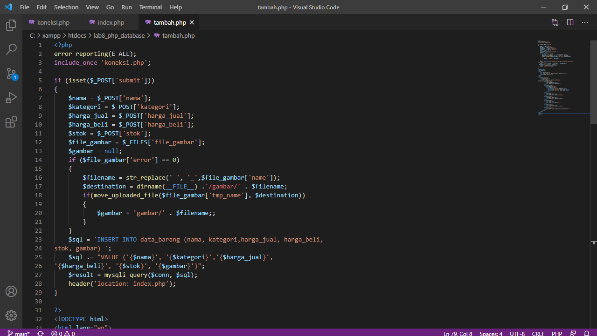
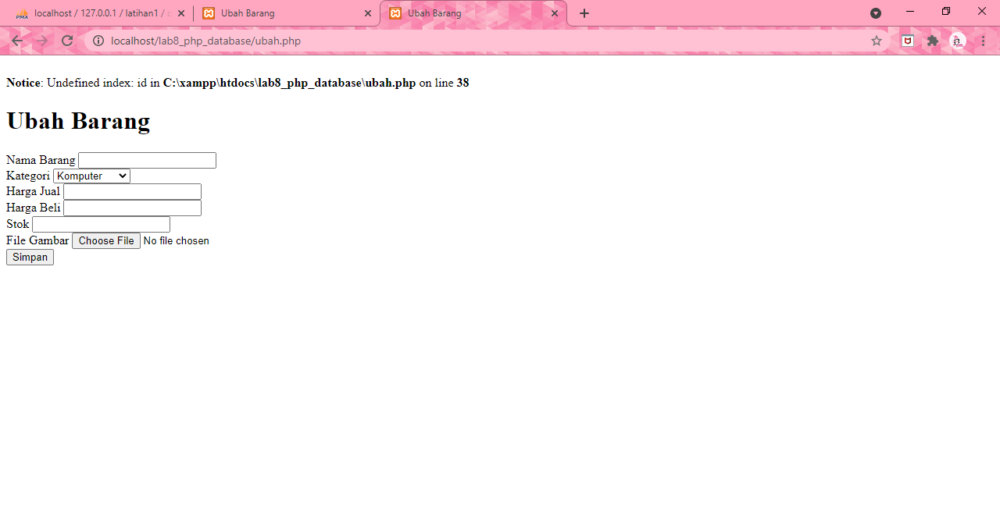

# Lab8Web

### Membuat Database PHP

##### Nama  : Windy Septiani
##### NIM   : 311910673 
##### Kelas : 19.TI.F.1 

### Praktikum 8
##### Membuat folder baru dengan nama lab8_php_database pada docroot webserver (htdocs)

##### Pastikan webserver Apache dan MySQL server sudah dijalankan.

##### Kemudian buka melalui browser: http://localhost/phpmyadmin/

##### Membuat Database = CREATE DATABASE latihan1;

##### Membuat Tabel

##### Untuk mengakses direktory tersebut pada web server dengan mengakses URL: http://localhost/lab8_php_database

##### Membuat file koneksi database
Code untuk koneksi database

Gambar tampilan di browser

##### Membuat file index untuk menampilkan data (Read)
Code untuk menampilkan data

Gambar tampilan di browser

##### Menambah Data (Create)
Code untuk menambahkan data

Gambar tampilan di browser

##### Mengubah Data (Update)
Code untuk mengubah data

Gambar tampilan di browser

##### Menghapus Data (Delete)
Code untuk menghapus data
